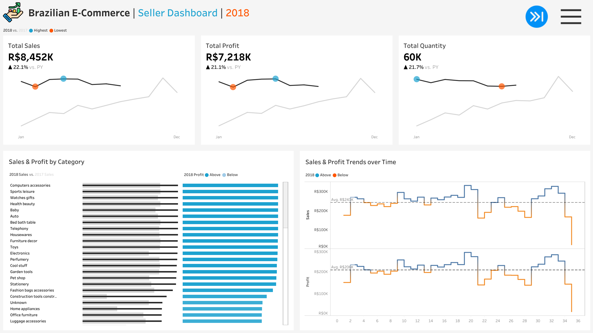

# Brazil E-Commerce Analysis: Olist Dataset

Data Visualization Tableau: https://public.tableau.com/views/VisualisasiBrazilE-Commerce/Dashboard1?:language=en-US&:sid=&:redirect=auth&:display_count=n&:origin=viz_share_link

## 🔍 Project Overview
An end-to-end analysis of Olist's Brazilian e-commerce marketplace, covering:
- Data extraction and cleaning with **MySQL**
- Interactive dashboards in **Tableau**
- Business insights on sales, profits, customers, and logistics

## 🛠️ Tech Stack
| Tool       | Purpose                          |
|------------|----------------------------------|
| MySQL      | Data processing and querying     |
| Tableau    | Visualization and dashboards     |
| Excel      | Supplemental analysis (optional) |

## 📂 Dataset
Using [Olist's Brazilian E-Commerce Dataset](https://www.kaggle.com/datasets/olistbr/brazilian-ecommerce) containing:
- 100k+ orders
- Order items
- Products
- Product categories name translations
- Customers
- Sellers
- Geolocations
- Payment methods
- Customer reviews
